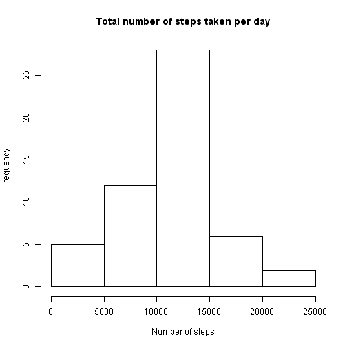
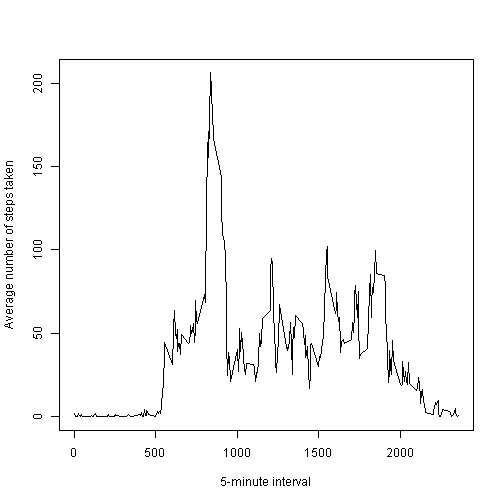
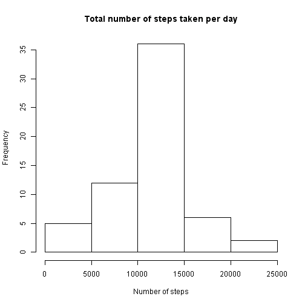
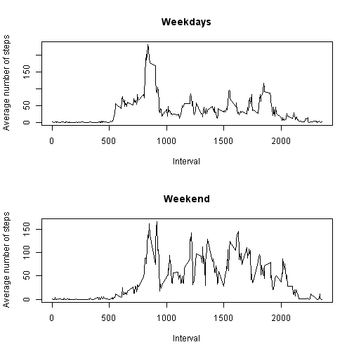

Peer Assessment 1
=============================

Loading and preprocessing the data
--------------------------------

Here we read downloaded file in R from .csv format.

```r
data <- read.csv("C:/R/activity.csv")
```


At first we want to ignore NAs. Lets get data without them.

```r
complete <- complete.cases(data)
dataFiltered <- data[complete,]
```

What is mean total number of steps taken per day?
-----------------------------------------

To see steps distribution lets make a histogram of the total number of steps taken each day.

```r
stepsPerDate <- aggregate(steps ~ date, dataFiltered, sum)
hist(stepsPerDate$steps, xlab = "Number of steps", 
     main = "Total number of steps taken per day")
```

 

What about mean and median?

```r
mean(stepsPerDate$steps)
```

```
## [1] 10766.19
```

```r
median(stepsPerDate$steps)
```

```
## [1] 10765
```

What is the average daily activity pattern?
--------------------------------------------

Lets see the plot of the average daily activity pattern.

```r
stepsPerInterval <- aggregate(steps ~ interval, dataFiltered, mean)
plot(stepsPerInterval$interval, stepsPerInterval$steps, type="l", 
     xlab = "5-minute interval", ylab = "Average number of steps taken")
```

 

Which 5-minute interval, on average across all the days in the dataset, contains the maximum number of steps?

```r
stepsPerInterval[stepsPerInterval$steps==max(stepsPerInterval$steps),]
```

```
##     interval    steps
## 104      835 206.1698
```

Imputing missing values
---------------------------------

Now we decided to use our NAs in calculations. How many NAs does our data set contain?

```r
dataNA <- data[!complete,]
nrow(dataNA)
```

```
## [1] 2304
```

Lets fill all NA values in our data with average steps taken for corresponding intervals.

```r
dataFull <- data
for (i in dataFull$interval) {
        dataFull$steps[dataFull$interval == i & !complete] <- stepsPerInterval[stepsPerInterval$interval == i, "steps"]
}
```

Take a look at new histogram of the total number of steps taken each day, its mean and median. 

```r
stepsPerDateFull <- aggregate(steps ~ date, dataFull, sum)
hist(stepsPerDateFull$steps, xlab = "Number of steps", 
     main = "Total number of steps taken per day")
```

 

```r
mean(stepsPerDateFull$steps)
```

```
## [1] 10766.19
```

```r
median(stepsPerDateFull$steps)
```

```
## [1] 10766.19
```

Now we can conclude that mean of data didn't changed (that shouldn't be unexpected). More interesting part is that median is different from the first result and equals to mean because there were days filled with NAs only.   
At histogram we see the difference in the middle 10000-15000 range. It happens due to the fact that new days have mean more than 10000 and less than 15000.  

Are there differences in activity patterns between weekdays and weekends?
-----------------------------------------------------

Lets see it.

```r
Sys.setlocale("LC_TIME","English United States")
```

```
## [1] "English_United States.1252"
```

```r
dataFull$day <- weekdays(as.Date(dataFull$date))
dataFull$day_type <- dataFull$day == "Saturday" | dataFull$day == "Sunday"
dataFull$day_type <- as.factor(dataFull$day_type)
levels(dataFull$day_type) <- c("weekday", "weekend")


stepsPerInterval$stepsWeekday <- aggregate(steps ~ interval, dataFull[dataFull$day_type == "weekday",], mean)[,2]
stepsPerInterval$stepsWeekend <- aggregate(steps ~ interval, dataFull[dataFull$day_type == "weekend",], mean)[,2]

   
par(mfrow=c(2,1))
plot(stepsPerInterval$interval, stepsPerInterval$stepsWeekday, 
     xlab = "Interval", ylab = "Average number of steps",
     type = "l", main = "Weekdays")
plot(stepsPerInterval$interval, stepsPerInterval$stepsWeekend, 
     xlab = "Interval", ylab = "Average number of steps",
     type = "l", main = "Weekend")
```

 
